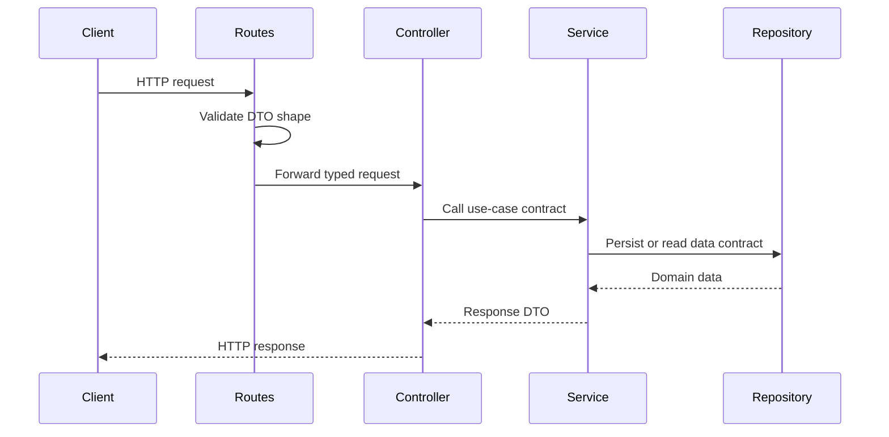

# API Spec

The backend exposes REST route contracts under `/api`. Route metadata is collected in `backend/src/routes/openapi-routes.ts` so it can be transformed into OpenAPI later.

## Core Endpoints

| Method | Path | Module | Purpose |
| --- | --- | --- | --- |
| POST | `/api/auth/login` | Auth | Authenticate a user |
| GET | `/api/products` | Products | List products |
| POST | `/api/products` | Products | Create product contract |
| GET | `/api/sales-orders` | Sales | List sales orders |
| POST | `/api/sales-orders` | Sales | Create sales order contract |
| POST | `/api/sales-orders/:id/confirm` | Sales | Confirm sales order contract |
| POST | `/api/sales-orders/:id/deliver` | Sales | Deliver sales order contract |
| POST | `/api/sales-orders/:id/cancel` | Sales | Cancel sales order contract |
| GET | `/api/purchase-orders` | Purchases | List purchase orders |
| POST | `/api/purchase-orders` | Purchases | Create purchase order contract |
| POST | `/api/purchase-orders/:id/receive` | Purchases | Receive purchase order contract |
| GET | `/api/inventory` | Inventory | Inventory overview contract |
| POST | `/api/inventory/reservations` | Inventory | Reserve stock contract |
| POST | `/api/inventory/releases` | Inventory | Release stock contract |
| GET | `/api/bill-of-materials` | Bill of Materials | List BOM contracts |
| POST | `/api/bill-of-materials` | Bill of Materials | Create BOM contract |
| GET | `/api/procurement/rules` | Procurement | List procurement rules |
| POST | `/api/procurement/plan` | Procurement | Plan procurement demand |
| GET | `/api/audit-logs` | Audit | List audit logs contract |

## Request Flow

