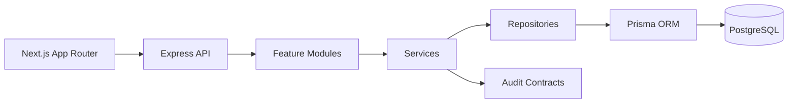

# SyncOps Architecture

SyncOps uses feature-based architecture to keep each ERP capability easy to find, review, and extend.



## Layers

| Layer | Responsibility |
| --- | --- |
| Controllers | Receive HTTP requests, call services, return HTTP responses |
| Services | Own business rules and orchestration contracts |
| Repositories | Own persistence interaction contracts |
| Validators | Validate request shape before controllers handle input |
| DTOs | Define request and response contracts |
| Types | Define internal domain-facing TypeScript interfaces |

## Backend Module Template

```text
module-name/
  controller.ts
  service.ts
  repository.ts
  routes.ts
  validation.ts
  dto.ts
  types.ts
  index.ts
```

## Frontend Structure

```text
src/
  app/          Route groups for auth, dashboard, and ERP modules
  components/   Shared UI, forms, tables, charts, layouts, navigation
  features/     Feature-specific clients, types, and view helpers
  services/     API clients
  hooks/        Shared React hooks
  store/        Zustand stores
  constants/    Route and module constants
  lib/          Query client and third-party setup
  utils/        Formatting and local helpers
  types/        Shared frontend contracts
```
