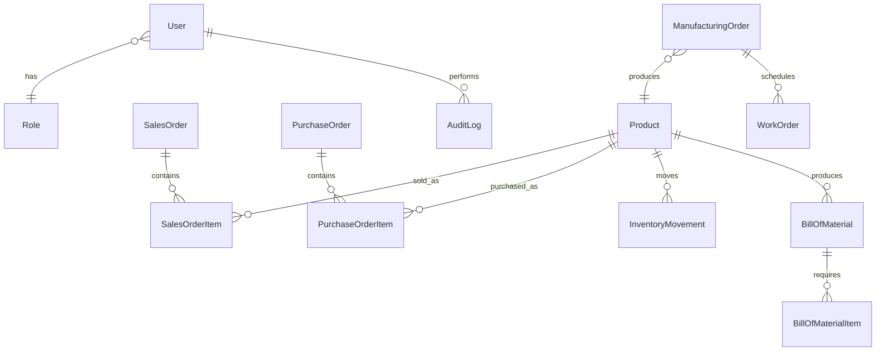

# Database Schema

The Prisma schema lives at `backend/prisma/schema.prisma`.

## Model Groups

- Identity: `User`, `Role`
- Parties: `Customer`, `Vendor`
- Catalog: `Product` (includes procurement config fields)
- Sales: `SalesOrder`, `SalesOrderItem`
- Purchasing: `PurchaseOrder`, `PurchaseOrderItem`
- Inventory: `InventoryMovement`
- Manufacturing: `BillOfMaterial`, `BillOfMaterialItem`, `ManufacturingOrder`, `WorkOrder`, `WorkCenter`
- Governance: `AuditLog`

## Stock Quantity Design

Stock quantities are **not stored on Product**. They are computed from `InventoryMovement`:

- `onHandQty` = SUM of all movements (positive = PURCHASE/PRODUCTION/ADJUSTMENT-in, negative = SALE/CONSUMPTION/ADJUSTMENT-out)
- `reservedQty` = SUM of undelivered quantities on CONFIRMED/PARTIALLY_DELIVERED SalesOrderItems + active MO component demand
- `freeToUseQty` = `onHandQty - reservedQty`

## Procurement Config on Product

| Field | Type | Purpose |
|---|---|---|
| `procureOnDemand` | Boolean | Enable auto-procurement on Sales confirm |
| `procurementMode` | MTS / MTO | Make to Stock vs Make to Order |
| `supplyStrategy` | BUY / MAKE | Auto-create PO vs MO |
| `preferredVendorId` | UUID? | Used when supplyStrategy = BUY |
| `activeBomId` | UUID? | Soft ref to BillOfMaterial; used when supplyStrategy = MAKE |

## Design Rules

- UUID primary keys.
- `createdAt`, `updatedAt`, and nullable `deletedAt` for soft delete support.
- Foreign keys for ownership and workflow relationships.
- Indexes on status, foreign keys, common lookup fields, and soft-delete columns.
- Enums for order statuses, movement types, manufacturing status, and audit events.

