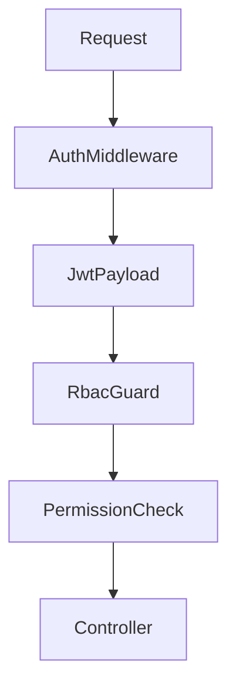

# RBAC

SyncOps uses role-based access control with route-level guards and module-level permission names.

## Roles

- Admin
- Sales User
- Purchase User
- Manufacturing User
- Inventory Manager
- Business Owner

## Permission Matrix

| Module | Admin | Sales User | Purchase User | Manufacturing User | Inventory Manager | Business Owner |
| --- | --- | --- | --- | --- | --- | --- |
| Auth | Manage | Own session | Own session | Own session | Own session | Own session |
| Users | Manage | Read self | Read self | Read self | Read self | Read reports |
| Products | Manage | Read | Read | Read | Manage stock fields | Read |
| Inventory | Manage | Reserve/release | Read receipts | Consume/produce | Manage | Read |
| Sales | Manage | Manage | Read | Read | Delivery updates | Read reports |
| Purchases | Manage | Read | Manage | Read | Receiving updates | Read reports |
| Manufacturing | Manage | Read | Read | Manage | Stock updates | Read reports |
| Procurement | Manage | Request | Request | Request | Manage | Read |
| Audit | Manage | Read own events | Read own events | Read own events | Read inventory events | Read all |
| Dashboard | Manage | Sales widgets | Purchase widgets | Manufacturing widgets | Inventory widgets | All widgets |

## Guard Structure

