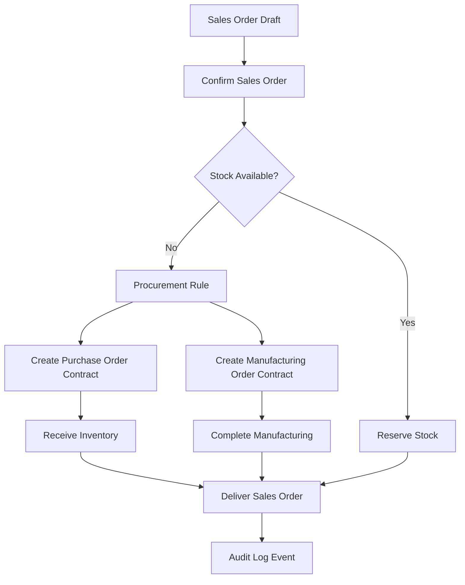

# Workflow

SyncOps connects demand, procurement, production, and delivery through typed contracts.

## Status Flows

### Sales

`Draft -> Confirmed -> PartiallyDelivered -> Delivered`

Cancellation is allowed by contract through `Cancelled`.

### Purchases

`Draft -> Confirmed -> PartiallyReceived -> Received`

Cancellation is allowed by contract through `Cancelled`.

### Manufacturing

`Draft -> Confirmed -> InProgress -> Completed`

## Procurement Modes

- MTS: Make to Stock, replenishes predefined stock levels.
- MTO: Make to Order, reacts to explicit order demand.

The scaffold defines interfaces only. It does not implement procurement decisions.
